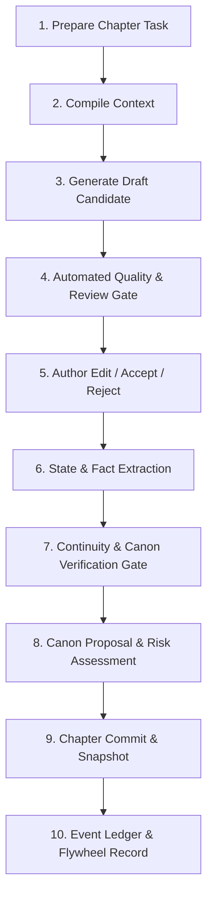

# MoZhou Novel OS 2.0: Story Kernel & Domain Specification

## 1. Executive Summary

MoZhou Novel OS treats a long-form novel as an enduring, plannable, generative, editable, traceable, rollbackable, and author-adaptive engineering system. The core is the **Story Kernel**, supported by the **Context Compiler**, **Change Impact Engine**, **Durable Novel Runtime**, and **Capability Registry**.

---

## 2. Core Domain Entities (The 9 Pillars)

### 2.1 `AuthorIntent` (The Constitutional Layer)
- **Purpose**: Defines the supreme non-negotiable boundaries of the work.
- **Fields**:
  - `premise`: Core selling point / hook.
  - `core_satisfaction_points`: Array of specific cathartic promises (爽点).
  - `protagonist_desire`: Irreducible core drive of the main character.
  - `absolute_taboos`: Explicit negative constraints (e.g., "No green-hat drama", "Never mock the master", "No arbitrary power reset").
  - `target_ending`: Intended resolution trajectory.
  - `tone_preference`: High-level narrative voice.

### 2.2 `OutlineGraph`
- **Purpose**: Hierarchical DAG representing structural narrative beats.
- **Levels**: `Book` → `Volume` → `Arc` → `Chapter` → `Scene/Beat`.
- **Fields**: `id`, `parent_id`, `type`, `title`, `goal`, `conflict`, `climax`, `outcome`, `dependency_node_ids`, `status` (`drafted`, `active`, `completed`, `stale`).

### 2.3 `TemporalFact`
- **Purpose**: Tracks atomic factual assertions bound to story time.
- **Fields**:
  - `id`: UUID.
  - `subject`: Entity identifier (e.g., `char:lin-xuan`).
  - `predicate`: Property name (e.g., `realm`, `injury_status`, `weapon`).
  - `value`: Atomic state value (e.g., `Foundation_Est_Late`, `left_arm_broken`).
  - `valid_from`: Chapter index where this fact becomes true.
  - `valid_until`: Chapter index where this fact ceases to be true (`null` if indefinite).
  - `importance`: `trivial` | `notable` | `critical`.
  - `source`: Chapter ID or outline node ID.
  - `status`: `planned` | `candidate` | `confirmed` | `rejected`.

### 2.4 `KnowledgeState`
- **Purpose**: Tracks factual visibility by entity to eliminate omniscience leakage.
- **Fields**:
  - `fact_id`: Reference to a `TemporalFact` or secret.
  - `entity_id`: `reader` | `protagonist` | specific character ID.
  - `known_since_chapter`: Chapter index when the entity learns the fact.
  - `distortion`: Optional distorted belief (e.g., "believes father was murdered by master").

### 2.5 `NarrativePromise`
- **Purpose**: Manages story commitments, suspense seeds, and foreshadowing.
- **Types**: `foreshadowing`, `suspense`, `reader_expectation`, `character_vow`, `countdown`, `quest`, `debt`, `secret`.
- **Fields**:
  - `id`: Identifier.
  - `type`: Promise type.
  - `description`: What was promised/planted.
  - `introduced_chapter`: Origin chapter.
  - `target_chapter`: Expected payoff chapter.
  - `status`: `introduced` → `reinforced` → `due` → `paid_off` | `abandoned` | `overdue`.
  - `payoff_notes`: Resolution evidence.

### 2.6 `RelationshipState`
- **Purpose**: Temporal dynamic modeling between two entities.
- **Fields**: `entity_a`, `entity_b`, `relationship_type`, `affinity_score` (-100 to +100), `valid_from`, `valid_until`, `source_chapter`.

### 2.7 `TimelineEvent`
- **Purpose**: Chronological milestone anchoring the story world time.
- **Fields**: `event_id`, `world_time_timestamp`, `chapter_index`, `location_id`, `participants`, `summary`, `impact_facts`.

### 2.8 `StyleProfile`
- **Purpose**: Machine-readable quantitative profile of prose mechanics.
- **Fields**: `dialogue_ratio`, `sentence_length_distribution`, `taboo_words`, `sensory_density`, `action_pacing`, `version`.

### 2.9 `ChapterCommit`
- **Purpose**: Immutable, transactional unit of finalized chapter work.
- **Fields**:
  - `chapter_index`: Integer.
  - `final_prose`: Full markdown text.
  - `summary`: Compressed narrative summary.
  - `fact_delta`: Added/modified `TemporalFact` assertions.
  - `relationship_delta`: Relational updates.
  - `knowledge_delta`: Newly learned revelations.
  - `promise_delta`: Status updates on promises.
  - `timeline_delta`: World time advance.
  - `dependency_manifest`: Explicit list of exact entity/fact versions consumed.
  - `commit_hash`: Deterministic content hash.

---

## 3. Chapter Production Transaction Pipeline

The lifecycle of writing chapter $N$ is strictly transactional:

### Risk-Graded Commit Thresholds:
- **Low-Risk** (auto-promoted): Spatial movement, minor inventory consumption.
- **Medium-Risk** (review panel staged): Relational shifts, minor injuries.
- **High-Risk** (blocking confirmation required): Entity death, major cultivation breakthroughs, world rule alterations, secret exposures, promise pay-offs.
